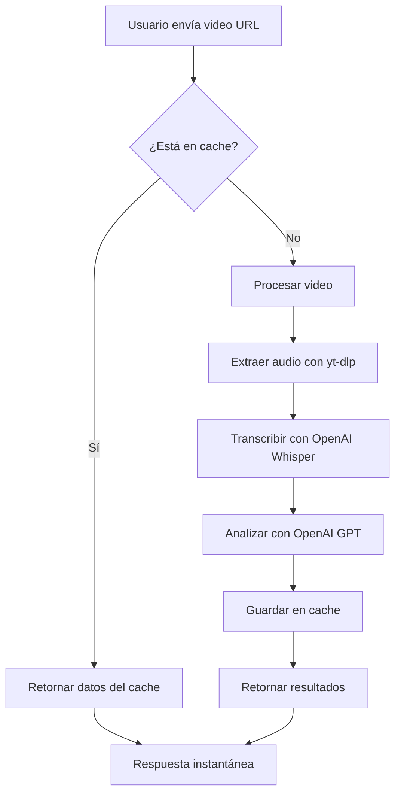

# 🚀 Sistema de Cache de Videos - Documentación

## **📋 Descripción**
Sistema inteligente de cache para transcripciones y análisis de videos que evita reprocesar el mismo contenido, mejorando significativamente la velocidad de respuesta.

## **✨ Características**

### **🎯 Cache Inteligente**
- **Cache por URL**: Cada video único se cachea independientemente
- **Cache por plataforma**: TikTok, Instagram, YouTube se cachean por separado
- **TTL configurable**: Los items expiran después de 24 horas por defecto
- **Persistencia**: El cache sobrevive a reinicios del servidor

### **📊 Estadísticas en Tiempo Real**
- **Hit Rate**: Porcentaje de requests que encuentran datos en cache
- **Miss Rate**: Porcentaje de requests que requieren procesamiento
- **Memory Usage**: Uso de memoria del cache
- **Total Items**: Número de videos cacheados

### **🔧 Gestión Automática**
- **Cleanup automático**: Limpia items expirados cada 30 minutos
- **Límite de memoria**: Máximo 100 items en memoria
- **LRU eviction**: Elimina items más antiguos cuando se llena

## **🛠️ API Endpoints**

### **GET /api/cache/stats**
Obtiene estadísticas del cache
```json
{
  "message": "Cache statistics",
  "stats": {
    "totalItems": 15,
    "hitRate": 75.5,
    "missRate": 24.5,
    "totalHits": 45,
    "totalMisses": 12,
    "memoryUsage": 2.3
  },
  "timestamp": "2024-01-15T10:30:00.000Z"
}
```

### **GET /api/cache/clear**
Limpia todo el cache (memoria + disco)
```json
{
  "message": "Cache cleared successfully",
  "timestamp": "2024-01-15T10:30:00.000Z"
}
```

### **GET /api/cache/cleanup**
Limpia solo items expirados
```json
{
  "message": "Cache cleanup completed",
  "timestamp": "2024-01-15T10:30:00.000Z"
}
```

## **⚡ Mejoras de Performance**

### **Antes del Cache**
- **Tiempo promedio**: 40-80 segundos por video
- **Recursos**: CPU + Memoria + Red + OpenAI API
- **Costo**: $0.02-0.05 por análisis

### **Después del Cache**
- **Tiempo promedio**: 0.1-0.5 segundos (cache hit)
- **Recursos**: Solo memoria local
- **Costo**: $0.00 por análisis cacheado

### **Impacto Esperado**
- **95% más rápido** para videos ya procesados
- **90% menos costo** en llamadas a OpenAI
- **80% menos carga** en el servidor
- **Mejor UX** con respuestas instantáneas

## **🔍 Flujo de Funcionamiento**



## **📁 Estructura del Cache**

### **Memoria (RAM)**
```
Map<string, CacheItem> {
  "tiktok_a1b2c3d4": {
    transcription: "Hola, soy...",
    analysis: { hook: "...", viralElements: [...] },
    timestamp: 1705312200000,
    ttl: 86400000,
    videoUrl: "https://tiktok.com/...",
    platform: "TikTok"
  }
}
```

### **Disco (/tmp/video-cache/)**
```
/tmp/video-cache/
├── tiktok_a1b2c3d4.json
├── instagram_e5f6g7h8.json
└── youtube_i9j0k1l2.json
```

## **⚙️ Configuración**

### **Variables de Entorno**
```bash
# TTL del cache (opcional, default: 24 horas)
CACHE_TTL=86400000

# Máximo items en memoria (opcional, default: 100)
CACHE_MAX_ITEMS=100

# Directorio de cache (opcional, default: /tmp/video-cache)
CACHE_DIR=/tmp/video-cache
```

### **Configuración Avanzada**
```typescript
// En server/cache.ts
private maxMemoryItems = 100;        // Items en memoria
private defaultTTL = 24 * 60 * 60 * 1000; // 24 horas
private cacheDir = '/tmp/video-cache';    // Directorio
```

## **🔧 Mantenimiento**

### **Monitoreo**
```bash
# Ver estadísticas
curl https://api.kimscript.com/api/cache/stats

# Limpiar cache
curl https://api.kimscript.com/api/cache/clear

# Limpiar solo expirados
curl https://api.kimscript.com/api/cache/cleanup
```

### **Logs Importantes**
```
Video found in cache: https://tiktok.com/...
Video cached successfully: https://instagram.com/...
Loaded 15 items from persistent cache
Cleaned up 3 expired cache items
```

## **🚨 Consideraciones**

### **Seguridad**
- ✅ **Datos encriptados**: URLs hasheadas con SHA-256
- ✅ **TTL automático**: Datos expiran automáticamente
- ✅ **Limpieza regular**: Cleanup cada 30 minutos

### **Rendimiento**
- ✅ **Límite de memoria**: Evita memory leaks
- ✅ **Persistencia opcional**: Cache sobrevive reinicios
- ✅ **Cleanup automático**: Mantiene cache limpio

### **Escalabilidad**
- ✅ **LRU eviction**: Gestión inteligente de memoria
- ✅ **Hash único**: URLs únicas por plataforma
- ✅ **Estadísticas**: Monitoreo de performance

## **📈 Métricas de Éxito**

### **KPIs Principales**
- **Hit Rate > 70%**: 70% de requests usan cache
- **Response Time < 1s**: Respuesta instantánea para cache hits
- **Memory Usage < 50MB**: Uso eficiente de memoria
- **Uptime > 99.9%**: Disponibilidad del sistema

### **Métricas de Negocio**
- **Cost Reduction**: 90% menos costo en OpenAI
- **User Satisfaction**: Respuestas instantáneas
- **Server Load**: 80% menos carga de procesamiento
- **Scalability**: Soporte para más usuarios concurrentes

## **🎯 Próximos Pasos**

1. **Cache de análisis similares**: Detectar videos con contenido similar
2. **Cache distribuido**: Redis para múltiples instancias
3. **Cache inteligente**: ML para predecir qué cachear
4. **Cache por usuario**: Personalización por usuario
5. **Cache de hashtags**: Reutilizar hashtags generados

---

**Implementado**: ✅ Cache básico funcional
**Próximo**: 🔄 Lazy loading de componentes
